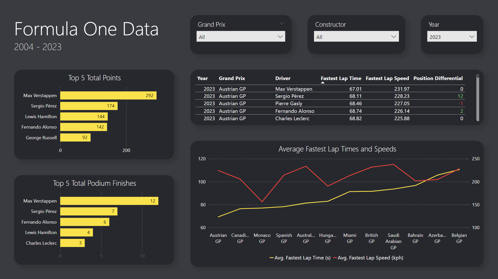

This project showcases the use of SQL to build and modify tables, and use joins to query data. I used Power BI to connect to the database and used queries to pull the necessary data. I created a dynamic dashboard which highlights the top drivers and fastest lap data per Grand Prix. The dashboard can be filtered by Grand Prix, Constructor, and Year.

